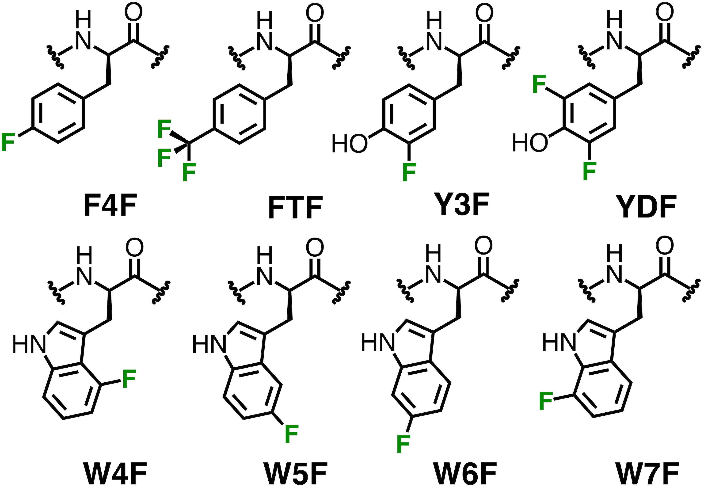

# ff15ipq-19F manuscript: scripts and input files

These files are associated with the following publication:  

DT Yang, AM Gronenborn, LT Chong. “Integrating Fluorinated Amino Acids into the Framework of the AMBER ff15ipq Force Field.” bioRxiv 2022, 475229; doi: https://doi.org/10.1101/2022.01.06.475229

* force field parameters for fluorinated amino acids commonly used with 19F NMR experiments

   

* added key files with .py, .sh, .in, .pdb, and .slurm extensions
    * using these files, all results should be reproducible
* see **/final_parameters** for the AMBER compatible frcmod (bonded parameters) and leap (ipq charges) files for use with the ff15ipq protein force field
* not all original files were included due to size limitations
    * raw data is available upon reasonable request: please email dty7@pitt.edu
* see analysis for Python scripts used for analysis and figure generation 
* for fluorine relaxation calculations, see https://github.com/darianyang/fluorelax

